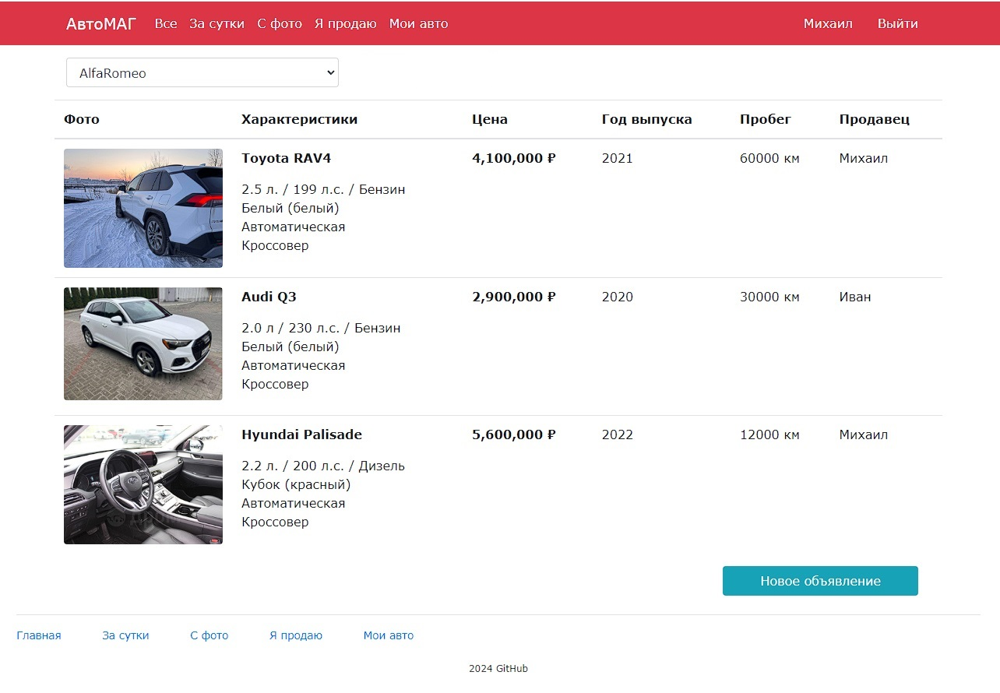
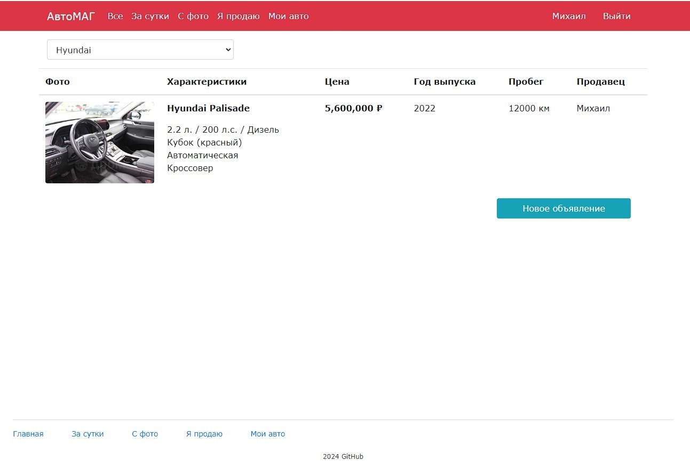
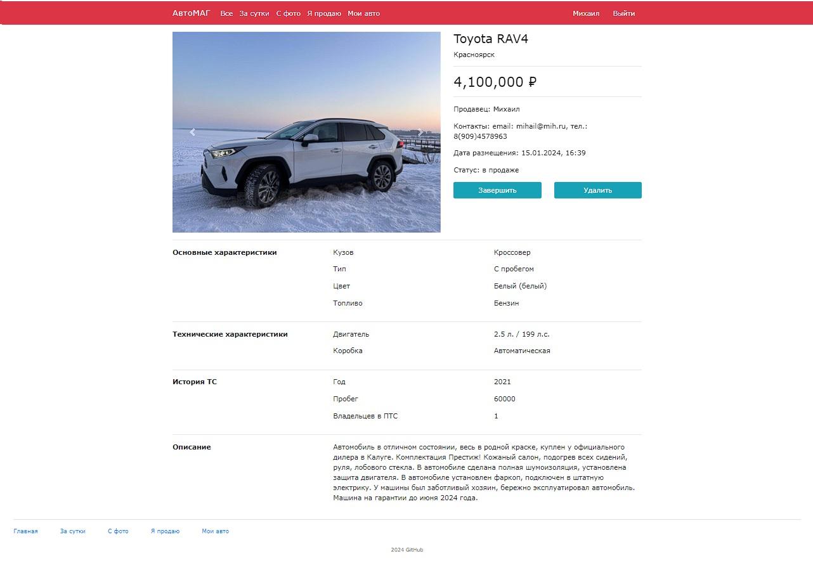

# АвтоМАГ
## Описание проекта
Сайт для размещения объявлений о продаже транспортных средств. Для создания и публикации объявления необходимо зарегистрироваться.
Незарегистрированному пользователю доступен просмотр списка объявлений, фильтры. При создании объявления доступен 
выбор свойств (цвет, бренд и др.) транспортного средства и можно добавить несколько фотографий. Пользователь может 
удалять, снимать с публикации только свои объявления. 
К списку объявлений возможно применение фильтров:
- все объявления
- за последние сутки
- с фото
- с автомобилями выбранного из списка бренда
- текущего пользователя

## Стек технологий
- Java 17
- Spring 2.7.3
- Hibernate 5.6.11
- Thymeleaf 3.0.15
- Liquibase 4.15.0
- PostgreSQL 42.5.4
- Maven 4.0.0
- Bootstrap 4.1.3
- Lombok 1.18.26
- Mockito 3.5.13

## Окружение
- Java 17
- PostgreSQL 16
- Apache Maven 4.0.0

## Запуск проекта
1. Скачать архив проекта или создать копию (fork) проекта в своем репозитории и клонировать.
2. Создать локальную базу данных car, используя интерфейс PostgreSQL 16 или команду:

   ```create database car```

3. В файл конфигурации db/liquibase.properties внести логин и пароль пользователя для доступа к базе данных car.
4. Запустить Liquibase для создания таблицы.
5. Для запуска на локальной машине скомпилировать и запустить проект в командной строке

   ```mvn spring-boot:run```

   или после сборки проекта с использованием maven выполнить в командной строке

   ``` java -jar target/job4j_cars-1.0-SNAPSHOT.jar```
6. Перейти по адресу http://localhost:8080/.
## Взаимодействие с приложением

### Страница регистрации пользователя


### Страница входа пользователя


### Список всех объявлений


### Список объявлений с применением фильтра по бренду


### Добавить автомобиль


### Добавить объявление


### Подробный просмотр объявления


### Список автомобилей у текущего пользователя


## Контакты

email: gretskih@mail.ru <br/>
telegram: @Anatolij_gr